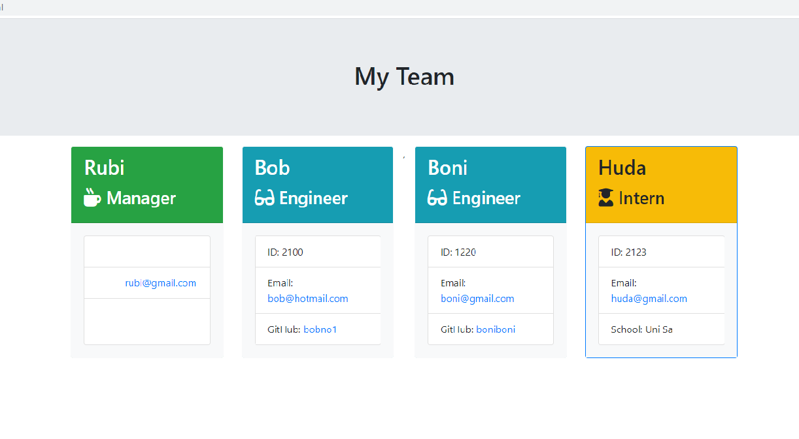

# Generate Team
___
## description

    Generate Team is a dynamically  generates ` Team build `  application. `Node.js is used in this application And for run this app, `NPM`  needs to install. `Manager` ccan select his team members like `Engineers` and `Interns` for his team and needs to provide team members detailes answering the prompt questions. After providing the detailes if choose exite  its autoate generate a html page all the choosen members.

   [View](https://rumardas.github.io/generate_team/)

##  Applications Uses in this projects
    * Html
    * css
    * Bootstrap
    * Node.js

## Instalation 

        npm install, gitignore

## Usage
 
        Here is a demo for how to use this app

 

[Demo](https://drive.google.com/file/d/1PqGyyB_0aFpz0nCpkar_aOfLTUyggktc/view/)

## page view
